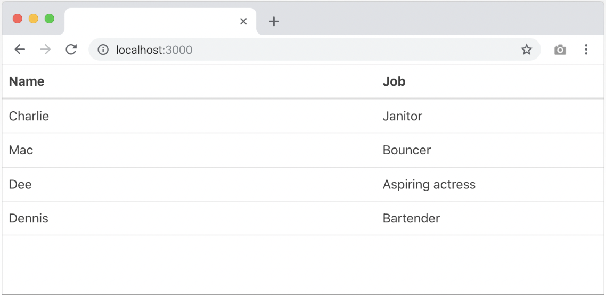
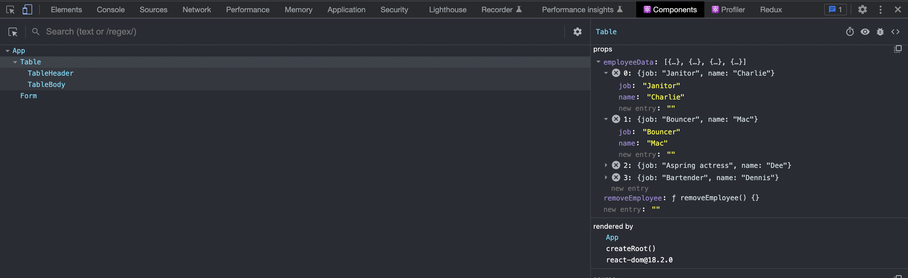
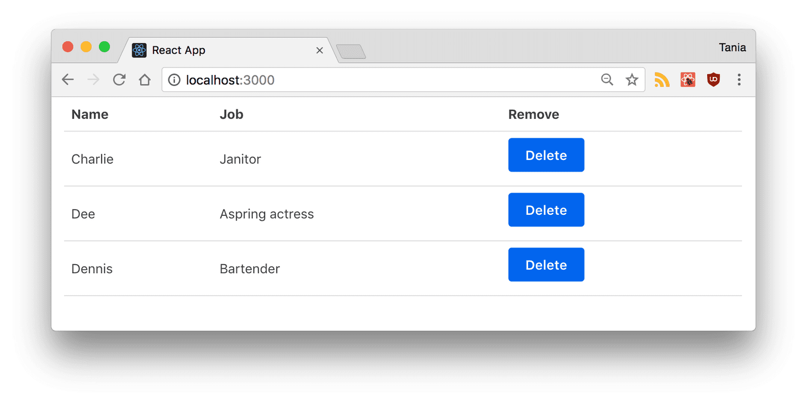
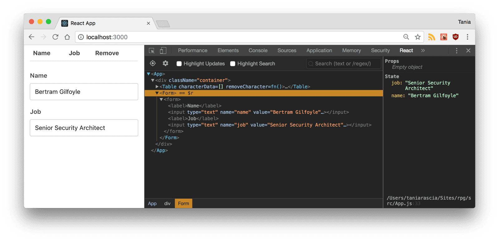
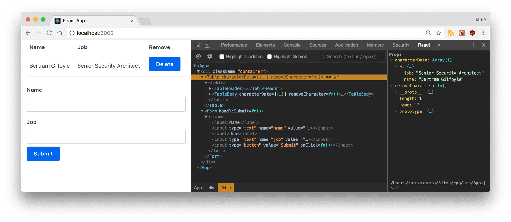

# React workshop
We will build a very simple React app that demonstrates the concepts learned in this session.
<br>
<br>
Here's the source and a live demo of the end result.
<ul>
  <li>Source code</li>
  <li>Demo</li>
</ul>

## Setup and Installation
To set up `create-react-app`, run the following code in your terminal, one directory up from where you want the project to live.

```
npx create-react-app react-tutorial
```
Once that finishes installing, move to the newly created directory and start the project.
```
cd react-tutorial && npm start
```
Once you run this command, a new window will popup at `localhost:3000` with your new React app.
<br><br>
If you look into the project structure, you'll see a `/public` and `/src` directory, along with the regular `node_modules`, `.gitignore`, `README.md`, and `package.json`.

In `/public`, our important file is `index.html`, which is very similar to the static `index.html` file we made earlier - just a root div. This time, no libraries or scripts are being loaded in. The `/src` directory will contain all our React code.
<br><br>
To see how the environment automatically compiles and updates your React code, find the line that looks like this in `/src/App.js`:
````
To get started, edit `src/App.js` and save to reload.
````
And replace it with any other text. Once you save the file, you'll notice `localhost:3000` compiles and refreshes with the new data.

Go ahead and delete all the files out of the `/src` directory, and we'll create our own boilerplate file without any bloat. We'll just keep index.css and `index.js`.
<br><br>
For `index.css`, I just copy-and-pasted the contents of <a href="https://taniarascia.github.io/primitive/css/main.css" target="_blank">Primitive CSS</a> into the file. If you want, you can use Bootstrap or whatever CSS framework you want, or nothing at all. I just find it easier to work with.
<br><br>
Now in `index.js`, we're importing React, ReactDOM, and the CSS file.
```jsx
// src/index.js
import React from 'react'
import ReactDOM from 'react-dom'
import './index.css'
```
Let's create our `App` component again. Before, we just had an `<h1>`, but now I'm adding in a div element with a class as well. You'll notice that we use `className` instead of `class`. This is our first hint that the code being written here is JavaScript, and not actually HTML.

```jsx
// src/index.js
const root = ReactDOM.createRoot(document.getElementById('root'));
root.render(
  <div className="App">
    <h1>Hello, React!</h1>
  </div>
);
```

Here's our full index.js.

```jsx
// src/index.js
import React from 'react'
import ReactDOM from 'react-dom'
import './index.css'

const root = ReactDOM.createRoot(document.getElementById('root'));
root.render(
  <div className="App">
    <h1>Hello, React!</h1>
  </div>
);
```

If you go back to `localhost:3000`, you'll see "Hello, React!" just like before. We have the beginnings of a React app now.

## React Developer Tools
There is an extension called React Developer Tools that will make your life much easier when working with React. Download <a href="https://chrome.google.com/webstore/detail/react-developer-tools/fmkadmapgofadopljbjfkapdkoienihi">React DevTools for Chrome</a>, or whatever browser you prefer to work on.
<br><br>
After you install it, when you open DevTools, you'll see a tab for React. Click on it, and you'll be able to inspect components as they're written. You can still go to the Elements tab to see the actual DOM output. It may not seem like that much of a deal now, but as the app gets more complicated, it will become increasingly necessary to use.
<br>

<br>
Now we have all the tools and setup we need to actually begin working with React.

## Components
So far, we've created one component - the `App` component. Almost everything in React consists of components, which can be `class components` or `function components`.
<br><br>
Remove the `App` class from `index.js`, so it looks like this.
```jsx
src/index.js
import React from 'react'
import ReactDOM from 'react-dom'
import App from './App'
import './index.css'

const root = ReactDOM.createRoot(document.getElementById('root'));
root.render(<App />);
```

We'll create a new file called `App.jsx` and put the component in there.

```jsx
// src/App.jsx
import React from 'react'

const App = () => {
  return (
    <div className="App">
      <h1>Hello, React!</h1>
    </div>
  )
}

export default App
```

We export the component as App and load it in `index.js`. It's not mandatory to separate components into files, but an application will start to get unwieldy and out-of-hand if you don't.

## Function components
Let's create another component. We're going to create a table. Make `Table.jsx`, and fill it with the following data.

```jsx
// src/Table.jsx
import React from 'react'

const Table = () => {
  return (
    <table>
      <thead>
        <tr>
          <th>Name</th>
          <th>Job</th>
        </tr>
      </thead>
      <tbody>
        <tr>
          <td>Charlie</td>
          <td>Janitor</td>
        </tr>
        <tr>
          <td>Mac</td>
          <td>Bouncer</td>
        </tr>
        <tr>
          <td>Dee</td>
          <td>Aspiring actress</td>
        </tr>
        <tr>
          <td>Dennis</td>
          <td>Bartender</td>
        </tr>
      </tbody>
    </table>
  )
}

export default Table
```

This component we created is a custom class component. We capitalize custom components to differentiate them from regular HTML elements. Back in `App.jsx`, we can load in the Table, first by importing it in:

```jsx
// src/App.jsx
import Table from './Table'
```

Here is the full content of `App.jsx`

```jsx
// src/App.jsx
import React from 'react'
import Table from './Table'

const App = () => {
  return (
    <div className="App">
      <Table />
    </div>
  )
}

export default App
```
If you check back on your live environment, you'll see the `Table` loaded in.
<br><br>

<br><br>
Now we've seen what a custom class component is. We could reuse this component over and over. However, since the data is hard-coded into it, it wouldn't be too useful at the moment.

### Refactor code
Now let's take a moment to refactor the code of `Table` into mini components `TableHeader`and `TableBody`

```jsx
// src/Table.tsx
const TableHeader = () => {
  return (
    <thead>
      <tr>
        <th>Name</th>
        <th>Job</th>
      </tr>
    </thead>
  )
}
```

then the body.

```jsx
// src/Table.tsx
const TableBody = () => {
  return (
    <tbody>
      <tr>
        <td>Charlie</td>
        <td>Janitor</td>
      </tr>
      <tr>
        <td>Mac</td>
        <td>Bouncer</td>
      </tr>
      <tr>
        <td>Dee</td>
        <td>Aspiring actress</td>
      </tr>
      <tr>
        <td>Dennis</td>
        <td>Bartender</td>
      </tr>
    </tbody>
  )
}
```

Now our `Table` file will look like this. Note that the `TableHeader` and `TableBody` components are all in the same file, and being used by the `Table` component.

```jsx
const TableHeader = () => { ... }
const TableBody = () => { ... }

const Table = () => {
  return (
    <table>
      <TableHeader />
      <TableBody />
    </table>
  );
};
```

## Props
Right now, we have a cool `Table` component, but the data is being hard-coded. One of the big deals about React is how it handles data, and it does so with properties, referred to as props, and with state. Now, we'll focus on handling data with props.
<br><br>
First, let's remove all the data from our `TableBody` component.

```jsx
// src/Table.jsx
const TableBody = () => {
  return <tbody />
}
```
Then let's move all that data to an array of objects, as if we were bringing in a JSON-based API. We'll have to create this array inside our `App.jsx` file.

```jsx
// src/App.jsx
import React from 'react'
import Table from './Table'

const employees = [
    {
      name: "Charlie",
      job: "Janitor",
    },
    {
      name: "Mac",
      job: "Bouncer",
    },
    {
      name: "Dee",
      job: "Aspring actress",
    },
    {
      name: "Dennis",
      job: "Bartender",
    },
  ];

const App = () => {
  return (
    <div className="App">
      <Table />
    </div>
  )
}

export default App
```

Now, we're going to pass the data through to the child component `(Table)` with properties. We can call the property whatever we want, as long as it's not a reserved keyword, so I'll go with `employeeData`. The data I'm passing through is the `employees` variable, and I'll put curly braces around it as it's a JavaScript expression.


```jsx
// src/App.jsx
import React from 'react'
import Table from './Table'

const employees = [
    {
      name: "Charlie",
      job: "Janitor",
    },
    {
      name: "Mac",
      job: "Bouncer",
    },
    {
      name: "Dee",
      job: "Aspring actress",
    },
    {
      name: "Dennis",
      job: "Bartender",
    },
  ];

const App = () => {
  return (
    <div className="App">
      <Table employeeData={employee} />
    </div>
  )
}

export default App
```
Now that data is being passed through to `Table`, we have to work on accessing it from the other side.

```jsx
const Table = ({ employeeData }) => {
  return (
    <table>
      <TableHeader />
      <TableBody employeeData={employeeData} />
    </table>
  );
};
```
If you open up React `DevTools` and inspect the `Table` component, you'll see the array of data in the property. The data that's stored here is known as the `virtual DOM`, which is a fast and efficient way of syncing data with the actual DOM.
<br><br>

<br><br>
Right now, `TableBody` takes no parameters and returns a single tag.

```jsx
const TableBody = () => {
  return <tbody />
}
```
We're going to pass the props through as a parameter, and map through the array to return a table row for each object in the array.
```jsx
const TableBody = ({ employeeData }) => {
  return (
    <tbody>
      {employeeData.map((employee, index) => (
        <tr key={index}>
          <td>{employee.name}</td>
          <td>{employee.job}</td>
        </tr>
      ))}
    </tbody>
  );
};
```

If you view the front end of the app, all the data is loading in now.
<br><br>
You'll notice I've added a key index to each table row. You should always use keys when making lists in React, as they help identify each list item. We'll also see how this is necessary in a moment when we want to manipulate list items.

## State
Right now, we're storing our character data in an array in a variable, and passing it through as props. This is good to start, but imagine if we want to be able to delete an item from the array. With props, we have a one way data flow, but with state we can update private data from a component.
<br><br>
To start, we're going to declare a new state variable and initialise it with our old array
```jsx
// src/App.jsx
import React, { useState } from "react";

import Table from "./components/Table";

const App = () => {
  const initialState = [
    {
      name: "Charlie",
      job: "Janitor",
    },
    {
      name: "Mac",
      job: "Bouncer",
    },
    {
      name: "Dee",
      job: "Aspring actress",
    },
    {
      name: "Dennis",
      job: "Bartender",
    },
  ];
  const [state, setState] = useState(initialState);
  
  return (
    <div className="App">
      <Table employeeData={state} />
    </div>
  )
}
```

Our data is officially contained in the state. Since we want to be able to remove a character from the table, we're going to create a `removeEmployee` method on the parent `App` component.
<br>
> You must use `setState()` to modify an array. Simply applying a new value to `state.property` will not work.

```jsx
// src/App.jsx
const removeEmployee = (index) => {
  setState(
    state.filter((emp, i) => {
      return i !== index;
    })
  );
};
```

`filter` does not mutate but rather creates a new array, and is a preferred method for modifying arrays in JavaScript. This particular method is testing an index vs. all the indices in the array, and returning all but the one that is passed through.
<br><br>
Now we have to pass that function through to the component, and render a button next to each character that can invoke the function. We'll pass the `removeEmployee` function through as a prop to `Table`.

```jsx
// src/App.js
return (
  <div className="container">
    <Table employeeData={state} removeEmployee={removeEmployee} />
  </div>
);
```
Since we're passing it down to `TableBody` from `Table`, we're going to have to pass it through again as a prop, just like we did with the character data.

```jsx
// src/Table.jsx
const Table = ({ employeeData, removeEmployee }) => {
  return (
    <table>
      <TableHeader />
      <TableBody employeeData={employeeData} removeEmployee={removeEmployee} />
    </table>
  );
};
```
Here's where that index we defined in the `removeEmployee()` method comes in. In the `TableBody` component, we'll pass the key/index through as a parameter, so the filter function knows which item to remove. We'll create a button with an `onClick` and pass it through.

```jsx
// src/Table.jsx
const TableBody = ({ employeeData, removeEmployee }) => {
  return (
    <tbody>
      {employeeData.map((employee, index) => (
        <tr key={index}>
          <td>{employee.name}</td>
          <td>{employee.job}</td>
          <td>
            <button onClick={() => removeEmployee(index)}>Delete</button>
          </td>
        </tr>
      ))}
    </tbody>
  );
};
```
> The `onClick` function must pass through a function that returns the `removeEmployee()` method, otherwise it will try to run automatically.
<br>
Awesome. Now we have delete buttons, and we can modify our state by deleting an employee.

<br><br>

<br><br>

## Submitting Form Data
Now we have data stored in state, and we can remove any item from the state. However, what if we wanted to be able to add new data to state? In a real world application, you'd more likely start with empty state and add to it, such as with a to-do list or a shopping cart.
<br><br>
Before anything else, let's remove all the hard-coded data from `state`, as we'll be updating that through the form now.
<br><br>
Now let's go ahead and create a `Form` component in a new file called `Form.jsx`.
<br><br>
We're going to set the initial state of the `Form` to be an object with some empty properties, and assign that initial state to `state`.

```jsx
// src/Form.jsx
import React, { useState } from "react";

const Form = () => {
  const initialState = {
    name: "",
    job: "",
  };
  const [state, setState] = useState(initialState);
```

Our goal for this form will be to update the state of `Form` every time a field is changed in the form, and when we submit, all that data will pass to the `App` state, which will then update the `Table`.
<br><br>
First, we'll make the function that will run every time a change is made to an input. The `event` will be passed through, and we'll set the state of `Form` to have the `id` (key) and `value` of the inputs.

```jsx
  const handleChange = (e) => {
    setState({
      ...state,
      [e.target.id]: e.target.value,
    });
  };
```

Let's get this working before we move on to submitting the form. In the render, let's get our two properties from state, and assign them as the values that correspond to the proper form keys. We'll run the `handleChange()` method as the `onChange` of the input, and finally we'll export the `Form` component.

```jsx
import React, { useState } from "react";

const Form = () => {
  const initialState = {
    name: "",
    job: "",
  };
  const [state, setState] = useState(initialState);

  const handleChange = (e) => {
    setState({
      ...state,
      [e.target.id]: e.target.value,
    });
  };

  return (
    <form>
      <label htmlFor="name">Name</label>
      <input
        type="text"
        name="name"
        id="name"
        value={state.name}
        onChange={handleChange}
      />
      <label htmlFor="job">Job</label>
      <input
        type="text"
        name="job"
        id="job"
        value={state.job}
        onChange={handleChange}
      />
    </form>
  );
};

export default Form;
```

In `App.jsx`, we can render the form below the table.

```jsx
import Form from './Form'
```

```jsx
  return (
    <div className="container">
      <Table employeeData={state} removeEmployee={removeEmployee} />
      <Form handleSubmit={handleSubmit} />
    </div>
  );
```
Now if we go to the front end of our app, we'll see a form that doesn't have a submit yet. Update some fields and you'll see the local state of `Form` being updated.

<br><br>

<br><br>

Cool. Last step is to allow us to actually submit that data and update the parent state. We'll create a function called `handleSubmit()` on `App` that will update the state by taking the existing `state` and adding the new `employee` parameter, using the ES6 spread operator.

```jsx
// src/App.jsx
const handleSubmit = (employee) => {
  setState([...state, employee]);
};
```
Let's make sure we pass that through as a parameter on `Form`.

```jsx
<Form handleSubmit={handleSubmit} />
```
Now in `Form`, we'll create a method called `submitForm()` that will call that function, and pass the `Form` state through as the employee parameter we defined earlier. It will also reset the state to the initial state, to clear the form after submit.

```jsx
// src/Form.jsx
const submitForm = (e) => {
  e.preventDefault();
  handleSubmit(state);
  setState(initialState);
};
```

Finally, we'll add a submit button to submit the form. 

```jsx
// src/Form.jsx
import React, { useState } from "react";

const Form = ({ handleSubmit }) => {
  const initialState = {
    name: "",
    job: "",
  };
  const [state, setState] = useState(initialState);

  const handleChange = (e) => {
    setState({
      ...state,
      [e.target.id]: e.target.value,
    });
  };

  const submitForm = (e) => {
    e.preventDefault();
    handleSubmit(state);
    setState(initialState);
  };

  return (
    <form onSubmit={submitForm}>
      <label htmlFor="name">Name</label>
      <input
        type="text"
        name="name"
        id="name"
        value={state.name}
        onChange={handleChange}
      />
      <label htmlFor="job">Job</label>
      <input
        type="text"
        name="job"
        id="job"
        value={state.job}
        onChange={handleChange}
      />
      <button type="submit">Submit</button>
    </form>
  );
};

export default Form;

```

And that's it! The app is complete. We can create, add, and remove users from our table. Since the `Table` and `TableBody` were already pulling from the state, it will display properly.

<br><br>

<br><br>

If you got lost anywhere along the way, you can view the complete source on GitHub.
