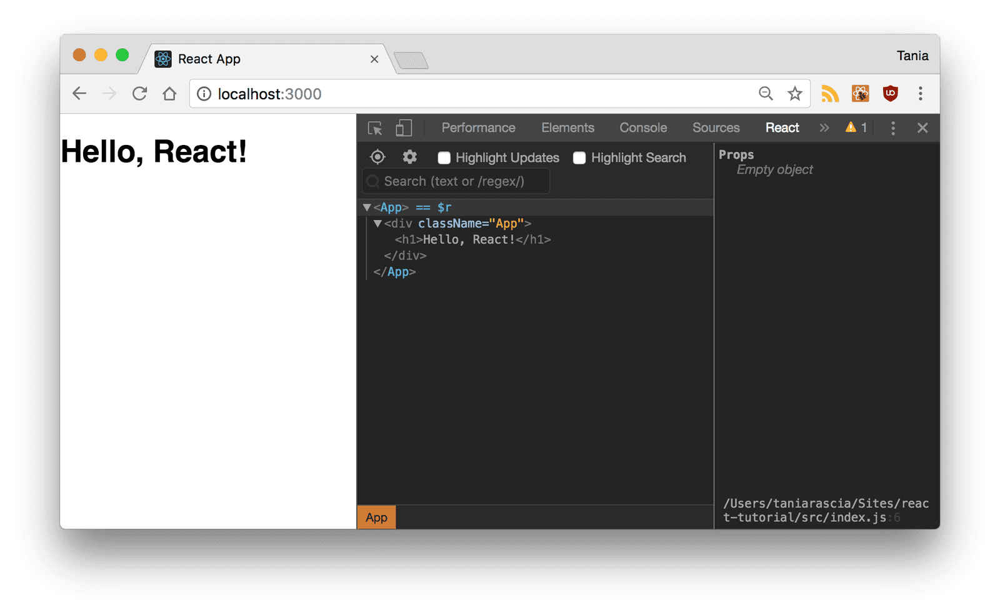

# React workshop
We will build a very simple React app that demonstrates the concepts learned in this session.
<br>
<br>
Here's the source and a live demo of the end result.
<ul>
  <li>Source code</li>
  <li>Demo</li>
</ul>

## Setup and Installation
To set up `create-react-app`, run the following code in your terminal, one directory up from where you want the project to live.

```
npx create-react-app react-tutorial
```
Once that finishes installing, move to the newly created directory and start the project.
```
cd react-tutorial && npm start
```
Once you run this command, a new window will popup at `localhost:3000` with your new React app.
<br><br>
If you look into the project structure, you'll see a `/public` and `/src` directory, along with the regular `node_modules`, `.gitignore`, `README.md`, and `package.json`.

In `/public`, our important file is `index.html`, which is very similar to the static `index.html` file we made earlier - just a root div. This time, no libraries or scripts are being loaded in. The `/src` directory will contain all our React code.
<br><br>
To see how the environment automatically compiles and updates your React code, find the line that looks like this in `/src/App.js`:
````
To get started, edit `src/App.js` and save to reload.
````
And replace it with any other text. Once you save the file, you'll notice `localhost:3000` compiles and refreshes with the new data.

Go ahead and delete all the files out of the `/src` directory, and we'll create our own boilerplate file without any bloat. We'll just keep index.css and `index.js`.
<br><br>
For `index.css`, I just copy-and-pasted the contents of <a href="https://taniarascia.github.io/primitive/css/main.css" target="_blank">Primitive CSS</a> into the file. If you want, you can use Bootstrap or whatever CSS framework you want, or nothing at all. I just find it easier to work with.
<br><br>
Now in `index.js`, we're importing React, ReactDOM, and the CSS file.
```jsx
// src/index.js
import React from 'react'
import ReactDOM from 'react-dom'
import './index.css'
```
Let's create our `App` component again. Before, we just had an `<h1>`, but now I'm adding in a div element with a class as well. You'll notice that we use `className` instead of `class`. This is our first hint that the code being written here is JavaScript, and not actually HTML.

```jsx
// src/index.js
const root = ReactDOM.createRoot(document.getElementById('root'));
root.render(
  <div className="App">
    <h1>Hello, React!</h1>
  </div>
);
```

Here's our full index.js.

```jsx
// src/index.js
import React from 'react'
import ReactDOM from 'react-dom'
import './index.css'

const root = ReactDOM.createRoot(document.getElementById('root'));
root.render(
  <div className="App">
    <h1>Hello, React!</h1>
  </div>
);
```

If you go back to `localhost:3000, you'll see "Hello, React!" just like before. We have the beginnings of a React app now.

## React Developer Tools
There is an extension called React Developer Tools that will make your life much easier when working with React. Download <a href="https://chrome.google.com/webstore/detail/react-developer-tools/fmkadmapgofadopljbjfkapdkoienihi">React DevTools for Chrome</a>, or whatever browser you prefer to work on.
<br><br>
After you install it, when you open DevTools, you'll see a tab for React. Click on it, and you'll be able to inspect components as they're written. You can still go to the Elements tab to see the actual DOM output. It may not seem like that much of a deal now, but as the app gets more complicated, it will become increasingly necessary to use.

